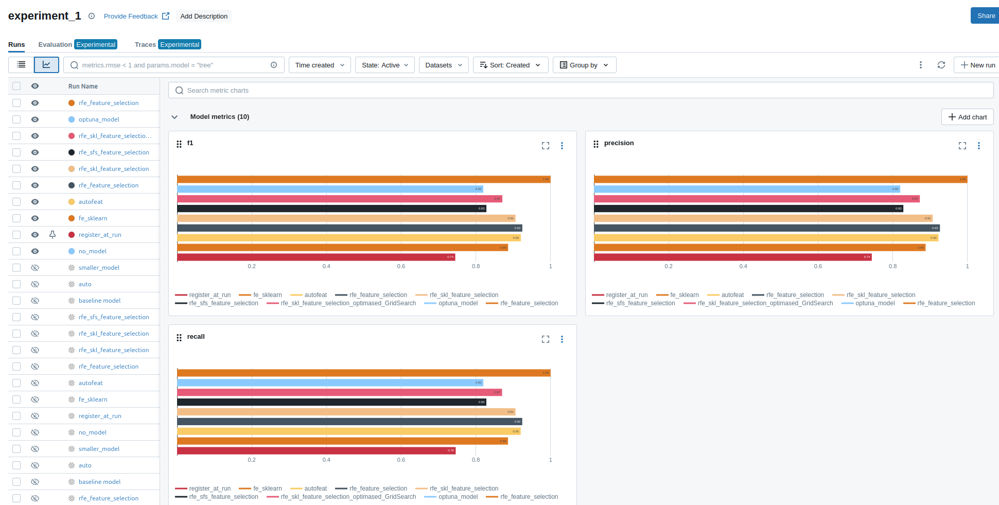
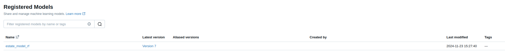

# Описание проекта
Проект посвящён анализу данных и решению задачи регрессии (предсказание цен на телефоны) 

[Датасет](https://www.kaggle.com/datasets/iabhishekofficial/mobile-price-classification) 

## Установка и запуск

Для MacOs Linux вместо python использовать python3

**1. Клонировать репозиторий:**
```
git clone https://github.com/KozlovIA/IIS_LR1
```

**2. Перейти в папку проекта:**
```
cd /IIS_LR1/
```

**3. Cоздать и активировать виртуальное окружение:**
```
python -m venv venv
```

Для Windows:
```
venv\Scripts\activate.bat
```

Для MacOs/Linux:
```
source venv/bin/activate
```

**4. Установить зависимости из файла requirements.txt:**
- Обновить пакетный менеджер pip
```
python -m pip install --upgrade pip
```

- Установить зависимости
```
pip install -r requirements.txt
```
**5. Создать папку data и поместить в неё датасет**
```
mkdir data
```
# Исследование данных

### Очистка данных 
- Приведены к категориальному типу: 
['blue',
 'dual_sim',
 'four_g',
 'three_g',
 'touch_screen',
 'wifi',
 'price_range'].
- Приведены к оптимальным числовым видам: 
 ['battery_power',
 'clock_speed',
 'fc',
 'int_memory',
 'm_dep',
 'mobile_wt',
 'n_cores',
 'pc',
 'px_height',
 'px_width',
 'ram',
 'sc_h',
 'sc_w',
 'talk_time']
- Дубликатов не обнаружено
- Удалось добиться уменьшения размера выборки 2 раза, путём приведения данных к более оптимальным типам, которые удалось подобрать за счет метода describe

### Анализ признаков для модели


- Таким образом понимаем, что цена на телефоны зависит от плотности пикселей


- Телефоны с большим ОЗУ имеют стоимость выше


- Телефоны с более мощной батареей имеют стоимость выше


- Наблюдаем очевидную корреляцию между ценой и батареей, ценой и ОЗУ, ценой и плостью пикселей
- Так же есть корреляция между мегапикселями основной и фронтальной камеры
- В выборке сбалансировано представлены телефоны всех ценовых категорий.


# Запуск MLFlow

1. Перейти в директорию mlflow
```
cd mlflow
```

2. Выполинть в терминале следующую команду
```
source start_mlflow.sh
```

# Исследование

Лучший результат показала модель на основе sklearn RFE (rfe_feature_selection):

- В качестве средства оценки - RandomForestClassifier
- Количество объектов оценки - 12
- Шаг - 12

Метрики лучшего прогона:
- precision: 1
- recall: 1
- f1: 1
```
run_id = "542d03a28f6b465fa07070011e4928a8"
```

# Скриншот всех прогонов и их графиков с метриками качества.

# Скриншот зарегистрированных версий моделей



# Сервис классификации

Описание файлов в папке services:
- api_handler.py включает в себя функции, необходимые для работы модели в FastAPI (загрузка, обработка и т.п.)
- Dockerfile включает в себя необходимые команды для сборки контейнера с определёнными параметрами
- main.py содержит основные функции для создания предсказаний
- requirements.txt содержит необходимые для работы сервиса библиотеки


Описание файлов в папке models:
- get_model.py скрипт для получения модели и записи её в файл формата pkl
- model.pkl содержит модель полученную в прошлых исследованиях

Создание образа:
```
docker build . --tag mobile_classifier_model:0
```

Запуск контейнера:
```
docker run -p 8001:8000 -v $(pwd)/../models:/models mobile_classifier_model:0
```

Проверить работоспособность сервиса можно следующей командой:
```
curl -X 'POST' \'http://localhost:8001/api/prediction?mobile_id=1' \-H 'accept: application/json' \-H 'Content-Type: application/json' \-d '{"battery_power":	842,"blue":	     0,"clock_speed":	2.2,"dual_sim":	0,"fc":	1,"four_g":	0,"int_memory":	7,"m_dep":	0.6,"mobile_wt":	188,"n_cores":	2,"pc":	  2,"px_height": 20,"px_width": 756,"ram": 2549,"sc_h": 9,"sc_w": 7,"talk_time": 19,"three_g": 0,"touch_screen": 0,"wifi": 1
}'
```